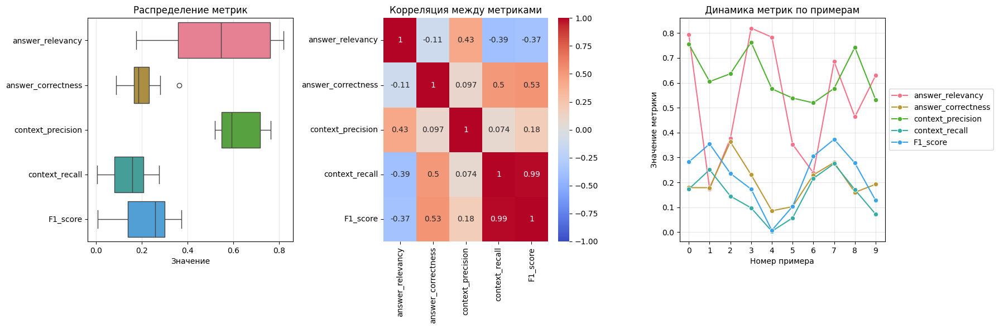

# Оценка RAG-сервисов
    
## Резюме исследования
1. **Метрики основаны на RAGas:**   
    - Изначально планировалось использовать RAGas напрямую, но из-за проблем с зависимостью от OpenAI API пришлось реализовать *кастомные* метрики.   
    - Основные идеи (например, оценка релевантности через косинусную схожесть) были взяты из концепции RAGas, но адаптированы под локальные русскоязычные модели.   
2. **Реализованные метрики**:   

|Метрика | Описание | Реализация |
|--------|----------|------------|
|   **Answer Relevancy** | Соответствие ответа исходному вопросу      | Косинусная схожесть эмбеддингов вопроса и ответа |
| **Answer Correctness** | Точность ответа относительно эталона       | Схожесть ответа с `ground truth` |
|  **Context Precision** | Релевантность найденного контекста вопросу | Средняя схожесть контекста с вопросом |
|     **Context Recall** | Полнота релевантного контекста             |  Максимальная схожесть эталона с контекстом |
|  **F1-Score**          | Баланс между точностью и полнотой          | Среднее гармоническое между Precision и Recall. |

3. **Особенности реализации**:   
    - Использованы **мультиязычные эмбеддинги** ( `paraphrase-multilingual-mpnet-base-v2`) вместо OpenAI.   
    - Для генерации ответов применена локальная модель **rugpt3medium**.   
    - Все вычисления выполняются **без внешних API**, что обеспечивает полную независимость.   
   
### Почему не удалось использовать RAGas напрямую:   
- **Проблема 1**: Многие метрики RAGas требуют OpenAI API (например, `faithfulness`, `answer_similarity`).   
- **Проблема 2**: Ограниченная поддержка русского языка в стандартных метриках (например, морфология, порядок слов).   
- **Проблема 3**: Ошибки при интеграции с Hugging Face моделями (например, конфликты версий).   
   
## Вывод   
Система оценки получилась гибридной — на основе RAGas сделана кастомная реализация под русский язык. Это позволило сохранить логику оценки, но избежать зависимостей от OpenAI API.   
